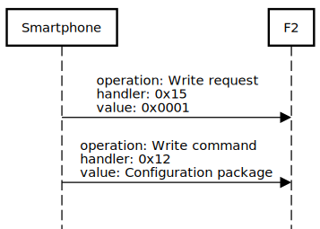
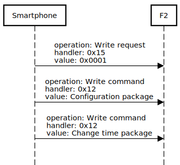
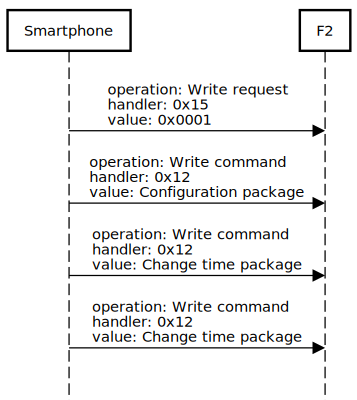
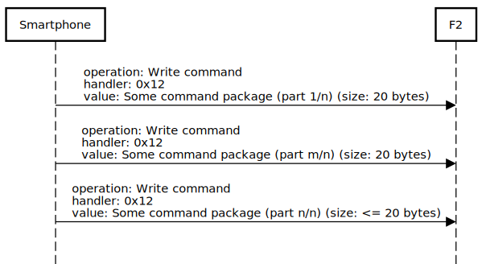
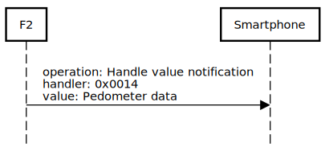
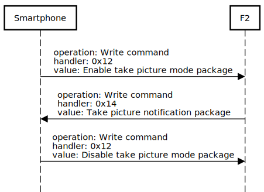

## Communication protocol definition

Once the Smartwatch (F2) is connected to the Smartphone, the next messages must be sent before the app
interact with the Smartwatch:
- Smartphone->F2: Write request to handler: 0x15 with value: 0x0001
- Smartphone->F2: Configuration package (defined in the next section)

Once its done, the Smartphone and the F2 start to exchange messages.

### Messages sent from the Smartphone to the F2:

Messages sent to the handler "0x0012" with GATT message type "Write command":  
- configuration package  
- change time  
- set and unset alarm  
- change barometer, altitude, temperature and UV  
- new call notification  
- new message notification  
- find device action  
- enable/disable take picture mode

### Messages sent from the F2 to the Smartphone:

Messages sent to the handler "0x0014" with GATT message type "Handle value notification":  
- pedometer information (It message is sent every time the any of the pedometer values change. At the beginning of the 
communication is sent with a little delay)
- take picture (It message is only received if the Smartwatch is in take picture mode)  

To receive messages, the phone must be subscribed to the characteristic with "c3e6fea2-e966-1000-8000-be99c223df6a"

## Message format
```
0      1      2      3      4           n-1      n  
+------+------+------+------+---- .... ---+------+  
| 0xa9 | PROT | 0x00 | SIZE |     DATA    | CSCK |  
+------+------+------+------+---- .... ---+------+ 
``` 

PROT: Protocol. Type of message in the payload  
SIZE: Length of the payload in bytes (n - 5)  
PAYL: Payload  
CSCK: Checksum  

If the package size is bigger than 20 bytes it is fragmented.  
As far as I known the fragmentation is not done in a higher level protocol.  

Some fields in the data may be represented by more than one byte.
In that case, it is represented in little endian format.  

All values are represented as unsigned integers.

### Type of message and payload for configuration package

Message type: 0x32  

Payload:  
```
0      1      2      3      4      5      6            12  
+------+------+------+------+------+------+---- .... ---+  
| 0x40 | 0xe2 | 0x01 | 0x00 | 0x00 | 0x00 |     ADDR    |  
+------+------+------+------+------+------+---- .... ---+  
```

ADDR: Bluetooth Address of the Smartwatch


### Type of message and payload for change time

Message type: 0x01  

Payload:  
```
0      1      2      3      4      5      6  
+------+------+------+------+------+------+  
| YEAR |  MON |  DAY | HOUR |  MIN |  SEC |  
+------+------+------+------+------+------+  
```

YEAR: Years since 2000  
MON: Month  
DAY: Day of the month  
HOUR: Hours in 24 hour clock system  
MIN: Minutes  
SEC: Seconds  

### Type of message and payload for set alarm

Message type: 0x02  

Payload:  
```
0      1      2      3  
+------+------+------+  
| HOUR |  MIN |  SEC |  
+------+------+------+  
```

HOUR: Hours in 24 hour clock system  
MIN: Minutes  
SEC: Seconds  

### Type of message and payload for unset alarm

Message type: 0x02  

Payload:  
```
00  
++  
||  
++  
```

Empty payload

### Type of message and payload for change barometer, altitude, temperature and UV

Message type: 0x1b  

Payload:  
```
0      1      2      3      4      5      6      7      8      9  
+------+------+------+------+------+------+------+------+------+  
|            BAR            |     ALT     |    TEMP     |  UV  |  
+------+------+------+------+------+------+------+------+------+  
```

BAR: Atmospheric pressure in pascals (range: [0, 299999])
ALT: Altitude in meters (range: [0, 9999])
TEMP: Temperature in celsius degrees (range: [0, 99])
UV:  Ultraviolet index (range: [1, 5] U [0] that is represented as 0x06)

### Type of message and payload for new call notification

Message type: **Not yet discovered**

Payload:  
**Not yet discovered**

Alternative format (Looks like bug):

Message type: 0x19

Payload:  
```
0      1  
+------+  
| 0x00 |  
+------+  
```

### Type of message and payload for new message notification

Message type: 0x19

Payload:  
```
0             n  
+---- .... ---+  
|     DATA    |  
+---- .... ---+  
```

DATA: Dt No F2 only shows a notification, but this field may contain the
message itself (not analyzed). This field must have at least 1 byte (1<=n).
In case its size is 1 byte, it must be different from 0x00.

### Type of message and payload for find device action

Message type: 0x0e

Payload: 
```
00  
++  
||  
++ 
``` 

Empty payload

Alternative format (Looks like bug):

Message type: 0x19  

Payload:  
```
00  
++  
||  
++ 
``` 

Empty payload

### Type of message and payload for pedometer information

Message type: 0x21 

Payload:
```  
0      1      2      3      4             n  
+------+------+------+------+---- .... ---+  
| YEAR |  MON |  DAY | SIZE |     DATA    |  
+------+------+------+------+---- .... ---+  
```

YEAR: Years since 2000  
MON: Month  
DAY: Day of the month  
SIZE: Number of packages contained on DATA ((n - 4) / 14)
DATA: At least one package with pedometer information. They are ordered in chronological order.

Pedometer data package format:  
```
0      1      2      3      4      5      6      7      8      9     10     11     12     13     14     15
+------+------+------+------+------+------+------+------+------+------+------+------+------+------+------+   
|  V1  |  V2  |  V3  |           STEP            |           KCAL            |            DIST           |  
+------+------+------+------+------+------+------+------+------+------+------+------+------+------+------+   
```

V1: **The meaning is not yet discovered**  
V2 :**The meaning is not yet discovered**  
V3: **The meaning is not yet discovered**  
STEP: Number if steps  
KCAL: Number of burnt kilocalorie  
DIST: Distance traveled in kilometers  

### Type of message and payload for enable/disable take picture mode

Message type: 0x1c  

Payload:  
```
0      1  
+------+  
| CONF |  
+------+  
```

CONF: Can take 2 values 0x01 (enable take picture mode) and 0x00 (disable take picture mode).  

### Type of message and payload for take picture notification

Message type: 0x0f  

Payload:  
```
0      1  
+------+  
| 0x01 |  
+------+  
```

## Examples
### Configuration


### Change time once


### Change time twice


### Send command (configuration done previously)


### Send command fractionated (configuration done previously)


### Receive pedometer data (configuration done previously)


### Take picture action
